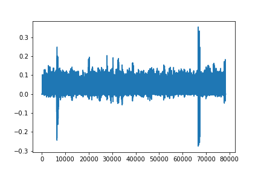

## 12/12/2020

### 1

con il mio codice ho fatto 160 epochs con batch a 100.


## 15/12/2020

### 1
con il codice originale, 160 batch da 50 samples


### 2

ho splittato mnist 25% di test e ho fittato una random forest, senza preprocessare. risultato: score = 0.97

### 3

ho fatto un fit con mnist 25% di test 160 epochs batch da 99 e ho fittato una random forest con i risultati. risultato: score = 0.943




# 16/12/2020

## 1

codice: mio

splitting: random

batch: 160

splitting: 16%

```
layer1.fit_single_batch( batch=batch, n_hiddens=100, delta=0.4, p=2, R=1,
                            scale=1, k=2, learn_rate=0.02, sigma=1,
                            activation_function=chu.activ, batch_size=99,
                            epoch=epoch, epochs=epochs)
```


forest score: 0.943571

## 2

ho fittato una foresta con numeri casuali:

```
a = np.random.normal(0, 1, (58800,100))

forest2.fit(a, y_train)
```
score=0.06

# 18/12/2020
cosa succede quando delta = 0?
```
layer1 = chu.CHUNeuralNetwork()
epochs=160
batch_size=100

start = time()
for epoch in range(epochs):
    X = X_train[np.random.permutation(len(X_train)),:]
    for i in range(0, len(X), batch_size):
        batch = X[i:i+batch_size]
        layer1 = layer1.fit_single_batch(batch=batch, n_hiddens=100, delta=0., p=2,
                                         R=1, scale=1, k=2, learn_rate=0.02,
                                         sigma=1, epoch=epoch, epochs=epochs)
    print(epoch)
```


score = 0.934
