# 18/12/2020
cosa succede quando delta = 0?
<details>

```
layer1 = chu.CHUNeuralNetwork()
epochs=160
batch_size=100

start = time()
for epoch in range(epochs):
    X = X_train[np.random.permutation(len(X_train)),:]
    for i in range(0, len(X), batch_size):
        batch = X[i:i+batch_size]
        layer1 = layer1.fit_single_batch(batch=batch, n_hiddens=100, delta=0., p=2,
                                         R=1, scale=1, k=2, learn_rate=0.02,
                                         sigma=1, epoch=epoch, epochs=epochs)
    print(epoch)
```


</details>

score = 0.934

# 21/12/2020

## 1

Ho provato con original-modified se non convergeva, e effettivamente non converge! questo è il codice:

<details>

```
import numpy as np
from sklearn.datasets import fetch_openml
from sklearn.model_selection import train_test_split
import matplotlib.pyplot as plt
import pandas as pd
from os.path import exists
import CHUNeuralNetwork as chu
from time import time
import utilities as utils

np.random.seed(1024)
rng = np.random.default_rng(1024)


# %% loading and splitting the MNIST dataset

if not exists('./database_file'):
    mnist, y = fetch_openml('mnist_784', version=1, return_X_y=True)
    mnist_dataframe = pd.DataFrame(mnist)
    mnist_dataframe.to_hdf("database_file", key="key")

X_train = np.array(pd.read_hdf("database_file"))/255.


# %%
eps0=0.02    # learning rate
Kx=10 # draw parameter
Ky=10 # draw parameter
hiddens=Kx*Ky    # number of hidden units that are displayed in Ky by Kx array
sigma=1.0 # init weight standard deviation
epochs=160      # number of epochs
batch_size=100      # size of the minibatch
prec=1e-30 # safety nonzero division parameter
delta=0.4    # Strength of the anti-hebbian learning
p=2.0        # Lebesgue norm of the weights
k=2          # ranking parameter, must be integer that is bigger or equal than 2

# %%


weight_matrix = np.random.normal(0, sigma, (hiddens, len(X_train[0]))) # init weights
start=time()
for epoch in range(epochs):
    X_train=X_train[np.random.permutation(len(X_train)),:]
    for batch in chu.batchize(X_train, batch_size):
        sig=np.sign(weight_matrix)
        product = batch @ (sig*np.absolute(weight_matrix)**(p-1)).T # (i,j)
        y=np.argsort(product)
        update = np.zeros((hiddens, len(X_train[0])))
        for i in range(len(batch)):
            h = y[i,-1]
            a = y[i,-k]
            update[h] += batch[i] - product[i,h] * weight_matrix[h]
            update[a] += -delta * (batch[i] - product[i,a] * weight_matrix[a])

        scaled_update = chu.scale_update(update, epoch, epochs, eps0)
        weight_matrix += scaled_update
    print(epoch)
print(time()-start)

utils.image_representation(weight_matrix)
```


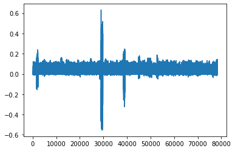
</details>

# comunicazione
da oggi in poi si lavora con delta = 0


## 2

Ho provato, con delta = 0.4, a non scramblare la batch internamente:

<details>

```
"""Instance CHUNeuralNetwork, fit, transform, represent weights as images."""

import numpy as np

import CHUNeuralNetwork as chu
from time import time
from sklearn.pipeline import Pipeline
from sklearn.ensemble import RandomForestClassifier
from sklearn.model_selection import cross_val_score
import utilities as utils
import random
np.random.seed(1024)
random.seed(0)

(X_train, y_train, X_test, y_test) = utils.mnist_loader(test_size=0.16)
batch_size=100


# %% fit the data

layer1 = chu.CHUNeuralNetwork()
epochs=160
X = X_train[np.random.permutation(len(X_train))]
batches=[]
for i in range(0, len(X_train), batch_size):
    batches.append(X[i:i+batch_size])

start = time()
for epoch in range(epochs):
    shuffle(batches)
    for batch in batches:
        layer1 = layer1.fit_single_batch(batch=batch, n_hiddens=100, delta=0, p=2,
                                         R=1, scale=1, k=2, learn_rate=0.02,
                                         sigma=1, epoch=epoch, epochs=epochs)
    print(epoch)

print(time()-start)

utils.image_representation(layer1.weight_matrix)


# %% second layer


transformed_train = layer1.transform(X_train, chu.activ, 4.5)
transformed_test = layer1.transform(X_test, chu.activ, 4.5)

forest1 = RandomForestClassifier()

start=time()
forest1.fit(transformed_train, y_train)
print(time()-start)

score1 = forest1.score(transformed_test, y_test)
# my score: 0.94
# no transform: 97
```


</details>

## 3

Ho provato anche questa strana versione intermedia:

<details>

```
"""Instance CHUNeuralNetwork, fit, transform, represent weights as images."""

import numpy as np

import CHUNeuralNetwork as chu
from time import time
from sklearn.pipeline import Pipeline
from sklearn.ensemble import RandomForestClassifier
from sklearn.model_selection import cross_val_score
import utilities as utils
import random
np.random.seed(1024)
random.seed(0)

(X_train, y_train, X_test, y_test) = utils.mnist_loader(test_size=0.16)
batch_size=100


# %% fit the data

layer1 = chu.CHUNeuralNetwork()
epochs=160


start = time()
for epoch in range(epochs):
    batches=[]
    X = X_train[np.random.permutation(len(X_train))]
    for i in range(0, len(X_train), batch_size):
        batches.append(X[i:i+batch_size])
    X = X_train[np.random.permutation(len(X_train))]
    for batch in batches:
        layer1 = layer1.fit_single_batch(batch=batch, n_hiddens=100, delta=0, p=2,
                                         R=1, scale=1, k=2, learn_rate=0.02,
                                         sigma=1, epoch=epoch, epochs=epochs)
    print(epoch)

print(time()-start)

utils.image_representation(layer1.weight_matrix)


# %% second layer


transformed_train = layer1.transform(X_train, chu.activ, 4.5)
transformed_test = layer1.transform(X_test, chu.activ, 4.5)

forest1 = RandomForestClassifier()

start=time()
forest1.fit(transformed_train, y_train)
print(time()-start)

score1 = forest1.score(transformed_test, y_test)
# my score: 0.94
# no transform: 97
```


</details>

# 22/12/2020

## 1

Ho provato per controllare se il random seed funziona. funziona.

<details>

```
"""Instance CHUNeuralNetwork, fit, transform, represent weights as images."""

import numpy as np

import CHUNeuralNetwork as chu
from time import time
from sklearn.pipeline import Pipeline
from sklearn.ensemble import RandomForestClassifier
from sklearn.model_selection import cross_val_score
import utilities as utils
import random
np.random.seed(1024)
random.seed(0)

(X_train, y_train, X_test, y_test) = utils.mnist_loader(test_size=0.16)
batch_size=100


# %% fit the data

layer1 = chu.CHUNeuralNetwork()
epochs=10


start = time()
for epoch in range(epochs):
    batches=[]
    X = X_train[np.random.permutation(len(X_train))]
    for i in range(0, len(X_train), batch_size):
        batches.append(X[i:i+batch_size])
    X = X_train[np.random.permutation(len(X_train))]
    for batch in batches:
        layer1 = layer1.fit_single_batch(batch=batch, n_hiddens=100, delta=0, p=2,
                                         R=1, scale=1, k=2, learn_rate=0.02,
                                         sigma=1, epoch=epoch, epochs=epochs)
    print(epoch)

print(time()-start)

utils.image_representation(layer1.weight_matrix)


# %% second layer


transformed_train = layer1.transform(X_train, chu.activ, 4.5)
transformed_test = layer1.transform(X_test, chu.activ, 4.5)

forest1 = RandomForestClassifier()

start=time()
forest1.fit(transformed_train, y_train)
print(time()-start)

score1 = forest1.score(transformed_test, y_test)
# my score: 0.94
# no transform: 97
```


</details>

## 2

è successa la cosa più strana... ho semplicemnte semplificato la procedura di creazione delle batch e adesso converge...

<details>

questo è il codice che converge:

```
"""Instance CHUNeuralNetwork, fit, transform, represent weights as images."""

import numpy as np

import CHUNeuralNetwork as chu
from time import time
from sklearn.pipeline import Pipeline
from sklearn.ensemble import RandomForestClassifier
from sklearn.model_selection import cross_val_score
import utilities as utils
import random
np.random.seed(1024)
random.seed(0)

(X_train, y_train, X_test, y_test) = utils.mnist_loader(test_size=0.16)
batch_size=100


# %% fit the data

layer1 = chu.CHUNeuralNetwork()
epochs=60

start = time()
for epoch in range(epochs):
    X = X_train[np.random.permutation(len(X_train))]
    for i in range(0, len(X), batch_size):
        batch = X[i:i+batch_size]
        layer1 = layer1.fit_single_batch(batch=batch, n_hiddens=100, delta=0.4
                                         , p=2,
                                         R=1, scale=1, k=2, learn_rate=0.02,
                                         sigma=1, epoch=epoch, epochs=epochs)
    print(epoch)
print(time()-start)

utils.image_representation(layer1.weight_matrix)


# %% second layer


transformed_train = layer1.transform(X_train, chu.activ, 4.5)
transformed_test = layer1.transform(X_test, chu.activ, 4.5)

forest1 = RandomForestClassifier()

start=time()
forest1.fit(transformed_train, y_train)
print(time()-start)

score1 = forest1.score(transformed_test, y_test)
# my score: 0.94
# no transform: 97

```

questo è il ciclo for che non converge:

```
for epoch in range(epochs):
    batches=[]
    X = X_train[np.random.permutation(len(X_train))]
    for i in range(0, len(X_train), batch_size):
        batches.append(X[i:i+batch_size])
    X = X_train[np.random.permutation(len(X_train))]
    for batch in batches:
        layer1 = layer1.fit_single_batch(batch=batch, n_hiddens=100, delta=0, p=2,
                                         R=1, scale=1, k=2, learn_rate=0.02,
                                         sigma=1, epoch=epoch, epochs=epochs)
    print(epoch)
```

ecco i risultati del codice che converge:


</details>

## 3

Ho provato a mettere:
* una funzione triangolare per inizializzare la matrice, con sigma come left and right;
* sigma = 0.01;
* average invece di amax in scale_update.

risultato: molto brutto. score 9%

<details>

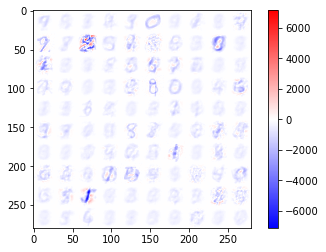


</details>

## 4

Ho fatto varie prove variando la sigma e la distribuzione di probabilità.

Innanzitutto: a 160 batch con sigma=1, la gaussiana non diverge, mentre la distribuzione triangolare sì, ecco cosa ottengo con la triangolare:

<details>


</details>

Poi: ho provato a diminuire la sigma a 0.1: e niente, vengono sempre i 9 sia con i triangoli che con le gaussiane! (molto interessante)

<details>


</details>


Faccio infine un altro backup del codice che mi da le cifre perché sono paranoico:


<details>

```
"""Instance CHUNeuralNetwork, fit, transform, represent weights as images."""

import numpy as np

import CHUNeuralNetwork as chu
from time import time
from sklearn.pipeline import Pipeline
from sklearn.ensemble import RandomForestClassifier
from sklearn.model_selection import cross_val_score
import utilities as utils
import random
np.random.seed(1024)
random.seed(0)

(X_train, y_train, X_test, y_test) = utils.mnist_loader(test_size=0.16)
batch_size=100


# %% fit the data

layer1 = chu.CHUNeuralNetwork()
epochs=160


start = time()

for epoch in range(epochs):
    X = X_train[np.random.permutation(len(X_train))]
    for i in range(0, len(X), batch_size):
        batch = X[i:i+batch_size]
        layer1 = layer1.fit_single_batch(batch=batch, n_hiddens=100, delta=0.4
                                         , p=2,
                                         R=1, scale=1, k=2, learn_rate=0.02,
                                         sigma=1, epoch=epoch, epochs=epochs)
    print(epoch)
print(time()-start)

utils.image_representation(layer1.weight_matrix)


# %% second layer


transformed_train = layer1.transform(X_train, chu.activ, 4.5)
transformed_test = layer1.transform(X_test, chu.activ, 4.5)

forest1 = RandomForestClassifier()

start=time()
forest1.fit(transformed_train, y_train)
print(time()-start)

score1 = forest1.score(transformed_test, y_test)
# my score: 0.94
# no transform: 97
```

</details>

## 5

Ho provato a mettere k=7. (sigma=1, 60 epochs)

<details>

</details>

# 23/12/2020

## 1

Ecco DI NUOVO i RISULTATI che CONVERGONO:

(score=94%)

<details>


```
"""Instance CHUNeuralNetwork, fit, transform, represent weights as images."""

import numpy as np

import CHUNeuralNetwork as chu
from time import time
from sklearn.pipeline import Pipeline
from sklearn.ensemble import RandomForestClassifier
from sklearn.model_selection import cross_val_score
import utilities as utils
import random
np.random.seed(1024)
random.seed(0)

(X_train, y_train, X_test, y_test) = utils.mnist_loader(test_size=0.16)
batch_size=100


# %% fit the data

layer1 = chu.CHUNeuralNetwork()
epochs=160


start = time()

for epoch in range(epochs):
    X = X_train[np.random.permutation(len(X_train))]
    for i in range(0, len(X), batch_size):
        batch = X[i:i+batch_size]
        layer1 = layer1.fit_single_batch(batch=batch, n_hiddens=100, delta=0.4
                                         , p=2,
                                         R=1, scale=1, k=2, learn_rate=0.02,
                                         sigma=1, epoch=epoch, epochs=epochs)
    print(epoch)
print(time()-start)

utils.image_representation(layer1.weight_matrix)


# %% second layer


transformed_train = layer1.transform(X_train, chu.activ, 4.5)
transformed_test = layer1.transform(X_test, chu.activ, 4.5)

forest1 = RandomForestClassifier()

start=time()
forest1.fit(transformed_train, y_train)
print(time()-start)

score1 = forest1.score(transformed_test, y_test)
# my score: 0.94
# no transform: 97
```

</details>

# 24/12/2020

## 1

Ho fatto un po' di prove sul perché non converge quando le p-norme sono tutte 1. succede che uno a caso dei vettori viene selezionato più di tutti. questi sono gli indici del vettore massimo ogni volta:

[11, 11,  5, 48, 67, 11, 67, 11, 11, 53, 11, 11, 67, 79,  4,  5, 30,
       11, 76, 74, 78, 11, 11, 74, 11, 11, 11,  5, 30, 53, 40, 92, 78, 48,
       92, 74, 11, 64,  8, 35, 63, 78, 78, 11, 27, 92, 11, 30, 78, 51, 76,
       11, 11, 66,  4, 79, 15,  9, 78, 30,  5, 78, 11, 54, 66, 30, 67,  4,
       90, 78, 66, 11, 58, 77, 11, 11, 48, 78, 30, 11, 54, 11, 11, 37, 58,
       11, 73, 78, 11, 66, 86, 78, 11, 40, 10, 30, 54, 11, 11, 64]

ed ecco cosa succede alle p-norm dopo una batch:

<details>


</details>

dopo due batch, la situazione è peggiorata:

<details>


</details>

## finalmente, convergenza, con sigma=10:

<details>

```
"""Instance CHUNeuralNetwork, fit, transform, represent weights as images."""

import numpy as np
import CHUNeuralNetwork as chu
from time import time
from sklearn.pipeline import Pipeline
from sklearn.ensemble import RandomForestClassifier
from sklearn.model_selection import cross_val_score
import utilities as utils
import random
np.random.seed(1024)
random.seed(0)

(X_train, y_train, X_test, y_test) = utils.mnist_loader(test_size=10000)
batch_size=100


# %% fit the data

layer1 = chu.CHUNeuralNetwork()
epochs=160


start = time()

for epoch in range(epochs):
    X = X_train[np.random.permutation(len(X_train))]
    batches = X.reshape((45000//batch_size, batch_size, 784))
    for batch in batches:
        layer1 = layer1.fit_single_batch(batch=batch, n_hiddens=100, delta=0.4,
                                         p=2,
                                         R=1, scale=1, k=2, learn_rate=0.02,
                                         sigma=10, epoch=epoch, epochs=epochs)
    print(epoch)
print(time()-start)

utils.image_representation(layer1.weight_matrix, 2)


# %% second layer


transformed_train = layer1.transform(X_train, chu.activ, 4.5)
transformed_test = layer1.transform(X_test, chu.activ, 4.5)

forest1 = RandomForestClassifier()

start=time()
forest1.fit(transformed_train, y_train)
print(time()-start)

score1 = forest1.score(transformed_test, y_test)
# my score: 0.94
# no transform: 97
```


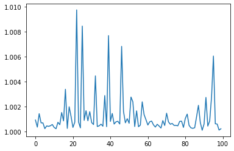


</details>

# Natale

## 1

Un po' di esplorazione dello spazio delle fasi oggi. Selezionati 5 parametri promettenti, prima di tutto prendo dei punti a caso nel loro spazio delle fasi, e li vado a confrontare con il valore che so convergere:

<details>

&Delta; = [0, 0.2, 0.4, 0.6, 0.8]

p = [2, 3, 4.5]

k= [2, 3, 4, 5, 6, 7]

&sigma; = [6, 8, 10, ]

LR = [0.01, 0.02, 0.03]

|&Delta;|p|k| &sigma;|LR|score|
|-|-|-|-|-|-|
|0.4|2  |2|10|0.02|94.01|
|0.8|3  |5|6 |0.01|28|
|0  |4.5|3|10|0.02|92|

quindi decido di partire dal primo. Cambio di relativamente poco tre parametri scelti a caso:

|&Delta;|p|k| &sigma;|LR|score|
|-|-|-|-|-|-|
|0.5|3  |3|10|0.02|94.71|

Ok, sta chiaramente succedendo qualcosa di interessante. Visivamente si vedono delle zone negative, però non c'è convergenza. forse gli serve più tempo per convergere? comunque l'opzione è scartata. torno al modelo di base, quello della prima riga della tabella.

provo questa combinazione:

|&Delta;|p|k| &sigma;|LR|score|
|-|-|-|-|-|-|
|0.4|2  |3|10|0.02|94.49|

non converge. La scarto e torno al modello di base. Stavolta cambio solo una variabile:

|&Delta;|p|k| &sigma;|LR|score|
|-|-|-|-|-|-|
|0.4|3  |2|10|0.02|94.28|

 L'ultima prova:

 |&Delta;|p|k| &sigma;|LR|score|
 |-|-|-|-|-|-|
 |0.4|1  |2|10|0.02||

 Niente, non converge.

 </details>

 Poi ho provato con vari valori di n:

<details>

 |n|1|3|4.5|5|
 |-|-|-|-|-|
 |score|93.92|93.99|94.01|93.99|

 </details>

 Poi ho provato a varire le dimensioni delle bach:

 Ora mi manca di provarlo con i tre splitting fatti:

<details>

|batch_size|score|
|-|-|
|200|neuroni che non convergono|
|100|94.01|
|90|93.97|
|50|93.54|

</details>

## 2

Ho provato con le tre suddivisioni in batch:

<details>

### batch Random

score = 94.01%


### batch monotematiche

score=94.34

(no convergenza)


### batch 1v1

score = 93.75

(no convergenza)


</details>

# 29/12/2020

## 1

Ho provato con 3 seed casuali per delta=0.4, e con 3 seed casuali per delta=0. Il risultato è che c'è convergenza costantemente per quando delta=0.

<details>

I primi tre grafici sono ottenuti con delta=0.4, gli ultimi tre con delta=0.


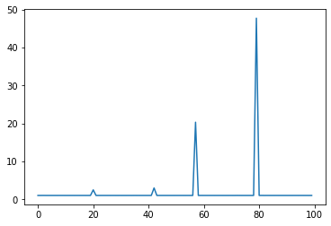
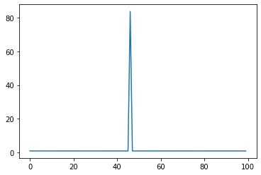
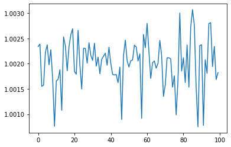
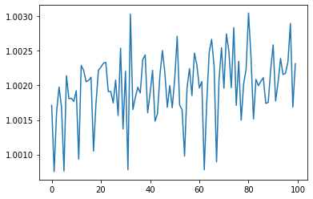
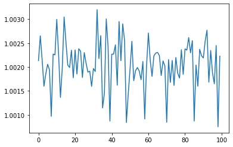

</details>

## 2

ho provato a mettere learning rate 0.1 (di solito è 0.02).
Risultato:

score 93.96

<details>


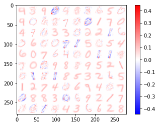

</details>

# 30/12/2020

## 1

Ho notato che con delta = 0 converge in 60 batch, ma il punteggio scende a 92% (che le batch siano 60 o 160). punteggio codice originale = 93.92%.

## 2
ho provato con  400 batch, delta=0.4, non arrivano tutti a 1 comunque, però convergono (non tutti a 1).

<details>

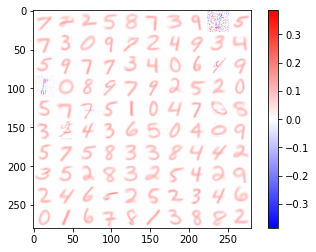
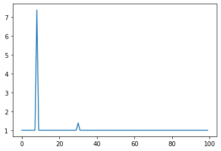

a 380 batch la situazione era questa:


</details>

## 3

Devo raccogliere dati su tre casi: il codice originale,
 il mio codice con delta=0 e 0.4. 5 casi per caso e costruiamo media dev. standard e dev. standard della media.

<details>

 risultati codice original: 93.61, 94.08, 94.07, 93.58, 93.98


 risultati senza transform: 96.54, 96.70, 96.56, 96.84, 96.58

 risultati codice mio con delta: 93.39, 93.12, 93.16, 93.15, 93.14

 risultarti codice mio senza delta: 93.17, 93.25, 93.05, 93.25, 93.13

 nota: con delta=0 i tempi si dimezzano.

 |caso|media|sem|
 |----|-----|---|
 |codice originale|93.9|0.11|
 |senza traformazione|96.54|0.05|
 |codice mio con delta|93.19|0.04|
 |codice mio senza delta|93.17|0.03|

 </details>

 # 31/12/2020

 Ho controlato la convergenza di mnist-mono e mnist-1v1: sulle 80 batch convergono entrambi. ho anche messo 2/3 matrici nel file.

# 03/01/2021

## 1

Devo raccogliere dati sulla convergenza e sul punteggio di mnist-mono e mnist-1v1.

Ho notato inostre che con ottanta batch e learn_rate 0.04 converge lo stesso.

<details>

punteggi di mnist-mono: 93.07, 93.31, 93.39, 92.59, 93.24

punteggi di mnist-1v1: 93.08, 93.04, 93.03, 92.75, 93.08

|caso|media|sem |
|----|-----|----|
|mono|93.1 |0.14|
|1v1 |93.00|0.06|

</details>

# 20/01/2020

## 1

Voglio provare a raccogliere dati con diversi apprendimenti supervised.
